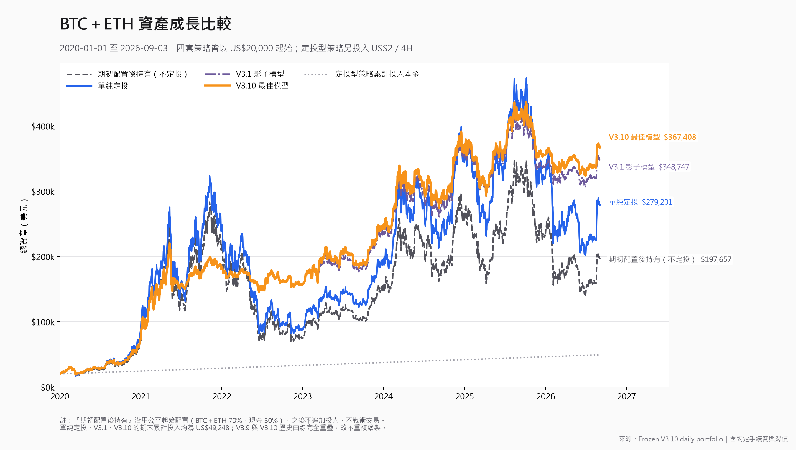

# Crypto Forward Monitor

一套研究 BTC／ETH 投資策略的 Windows 桌面工具：比較歷史回測、追蹤紙上資產，並讓自己的 GPT 協助判讀市場。

**目前只做紙上模擬，不會替你向交易所下真實訂單，也不保證獲利。**

## 介面看什麼？

- **左邊：V3.10＋AI 綜合版**。AI 參考 V3.10 技術狀態與可取得的外部資料，提出配置調整。
- **右邊：純 V3.10**。保留原本凍結規則，不受 AI 決策影響。
- 兩邊顯示總資產、BTC／ETH／現金配置、成本均價及浮動盈虧。
- 「執行摘要」與「AI 決策」可查看買賣時間、幣種、數量、金額與原因。

開啟 App 會讀取保存的持倉並更新行情，**不重設本金，也不自動呼叫 GPT**。要產生新決策，按「執行每日模型」。

## V3.10 的邏輯：定投＋市場週期避險

V3.10 是固定規則模型，不是網格，也不是會自行訓練或調參的 AI。

1. **固定投入資金**：每 4 小時追加 US$2。加密部位的基準比例為 BTC 62.5%、ETH 37.5%；待買資金累積達最低模擬下單額 US$5 才成交，不保證每 4 小時都有買單。
2. **判斷市場週期**：用已完成的價格資料、均線、回撤及市場結構，區分牛市、轉弱、熊市、累積與新牛市。
3. **轉弱時分階段減碼**：依 Stage 與崩盤煞車規則降低曝險、保留現金；復甦條件成立後，再依規則分批買回。
4. **Stage3 再進入多一道確認**：符合資格後，需要連續三個已完成日收盤確認 BTC 低於 SMA50、且 SMA20 低於 SMA50。Stage4／崩盤煞車仍優先，不必等這三天。

主體沿用 V3.1；V3.10 的直接策略修改僅限 Stage3 熊市再進入確認。狀態與持倉會變，**凍結規則不會自動改寫**，也不會為了讓回測更漂亮而調整門檻。

精確規則：[V3.10 設定](config/config_frozen_v3_10.json) · [規則解讀](design/V310_ASSUMPTIONS.md)。

## AI 的作用：綜合判讀，不改寫 V3.10

**Python 算技術指標，GPT 負責判讀。**

GPT 先看 V3.10 的 State、Stage、目標／實際曝險、回撤、Stage3、Crash 與模型動作，再綜合 BTC／ETH 技術面，以及實際可取得的宏觀、衍生品、資金流與新聞。ETF、鏈上等資料沒有可靠來源時會標示缺漏，不會自行補造。

輸出包含加碼／維持／減碼／退出建議（STRONG_ADD、ADD、HOLD、REDUCE、EXIT）、信心、市場健康、牛／中性／熊情境機率、BTC／ETH／現金配置、利多、風險與失效條件。這些分數與機率是模型判斷，不是已校準的勝率。

AI 建議還要通過程式風控：主動目標曝險最多 95%、單次調整最多 20 個百分點；崩盤／Stage4 時禁止 AI 增加曝險，也不能挪用受保護現金。資料或信心不足就不做 AI 調倉。最低曝險等限制仍適用，**EXIT 不代表一定全部清倉**。

第一次啟用綜合版會接續當時純 V3.10 的幣量與現金，之後兩個帳本分開運行。**目前 App 是「量化狀態＋AI 配置決策」：不自動複製純 V3.10 後續交易，HOLD 代表 AI 不調倉。** 右側純版照常依凍結規則執行。

## 如何連結自己的 AI？

第一次設定：

1. 開啟 App →「工具與設定」或「AI 決策」→ **ChatGPT 與 AI 設定**。
2. 按 **Continue with ChatGPT**，到官方登入頁登入自己的帳號。
3. 授權 **ChatGPT Plan Usage**，允許這個工具使用你的方案用量。
4. 回 App，按 **載入此帳號可用模型**，選擇帳號實際提供的模型。
5. 按 **啟用 V3.10＋AI／建立新綜合帳本**，確認接續目前持倉。不需要每天重建帳本。
6. 之後按一次 **執行每日模型**：V3.10 → 資料整理 → GPT 判讀 → 風控 → 紙上成交／報告。

連線採官方 **Sign in with ChatGPT（OAuth）**，不是填 API Key；模型清單與可用用量由帳號決定。沒有資格、額度不足或模型不可用時會提示，不會偷偷改用付費 API 備援。[官方登入方式](https://developers.openai.com/siwc/token-sharing-open-source/sign-in) · [模型與推論方式](https://developers.openai.com/siwc/token-sharing-open-source/models-and-inference)。

分析時會把市場快照及紙上持倉傳給 OpenAI。登入憑證保存在 Windows Credential Manager；私人帳本、帳號資料及本機設定不會上傳 GitHub。

## 第一次啟動（Windows）

AI 功能與使用說明已納入 `main`。下載本專案後，在專案根目錄執行：

```powershell
py -m venv .venv
.\.venv\Scripts\python.exe -m pip install -r requirements.txt
.\.venv\Scripts\python.exe -m pip install -r CryptoForwardMonitor\requirements.txt
if (-not (Test-Path -LiteralPath CryptoForwardMonitor\config.json)) {
    Copy-Item CryptoForwardMonitor\config.example.json CryptoForwardMonitor\config.json
}
.\CryptoForwardMonitor\run_app.bat
```

既有安裝不需要重新建立環境或覆蓋設定。若更換資料夾／使用 EXE，請核對設定中的 Python、模型及資料路徑。GitHub 提供原始碼，不包含本機 EXE 或你的登入資料。

## 回測結果與限制



這張圖是 **2020-01-01 至 2026-09-03 的既有凍結回測，不含 GPT**，也不是目前 App 的帳戶資產。各策略起始 US$20,000；定投型策略另追加 US$2／4H，虛線中的淺灰點線代表累計投入本金。[完整結果](v3_10/report/FINAL_REPORT_V3_10.md)。

另外完成過 30 次真實 GPT 的首月歷史探索，但它使用的完整引擎 overlay 與目前 App 綜合帳本不同，不能當成目前 App 的績效認證；模型也可能記得後來事件，**完整 AI 無前視驗證尚不能認證 PASS**。[首月測試與限制](docs/FIRST_MONTH_AI_REPLAY.md)。

原 V3.10 前瞻檢查點仍保留 **FORWARD SAFETY FAIL／證據不足**；凍結雜湊通過不等於整體安全驗收通過。[原始前瞻判決](v3_10_forward/V310_FORWARD_CHECKPOINT.md)。歷史回測的選版、選幣及過度擬合風險也不能靠加入 AI 消除。

關閉 App 不會刪除資產或紀錄，但關閉期間不會持續執行 GPT。下次成功執行會依保存的完成時段補入紙上外部本金，並不表示關閉時仍有真實定投。

## 更多說明

- [App 操作、均價與建置](CryptoForwardMonitor/README.md)
- [GitHub 保存範圍與換電腦還原](GITHUB_README.md)
- [初版 AI 技術驗證紀錄](docs/AI_SHADOW_V1_ACCEPTANCE_REPORT.md)
- [BTC／ETH／BNB 獨立定投診斷](universe_diagnostic/report/FIXED_DCA_UNIVERSE_DIAGNOSTIC.md)
